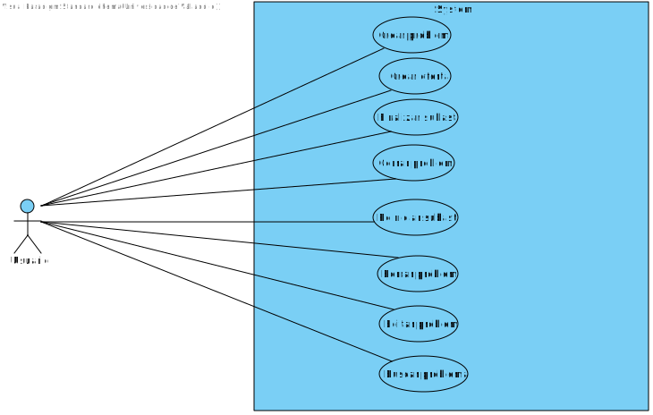
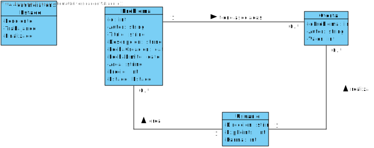
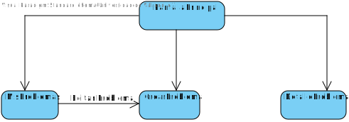

<h1>Documento resumen del proyecto para crear la aplicación "CodingResolver"</h1>

<ol>
<h2><li>Resumen del proyecto</li></h2>

En esta aplicación se publicarán problemas o necesidades relacionadas con la programación. Estos elementos pueden ser de diversos tipos como problemas de código, de software, de hardware, de sistemas operativos… Para cada elemento se publicará un título, una descripción, los áreas asociados, la fecha límite en la que el problema debe estar resuelto y el precio inicial que está dispuesto a pagar la persona que publica el problema por su resolución. 
Los usuarios verán estos problemas o necesidades y podrán realizar ofertas de qué precio aceptarían por resolver el elemento de manera que se ajuste este precio de forma similar a una subasta, realizando varios usuarios ofertas del precio que aceptarían y saliendo como ganadora la oferta con un menor precio ofrecido, comprometiéndose el usuario que la realizó a solucionar el problema o necesidad. Además los usuarios pueden modificar o eliminar los problemas que creen. Por otro lado, la aplicación también almacenará un contador para cada usuario con los puntos de experiencia que representará el número de problemas que ha resuelto el usuario y un contador de karma que determinará si el usuario cuando se compromete a resolver un problema ganando la puja, realmente lo resuelve. Este contador se inicia en 5 para cada usuario y se aumentará en 1 si el usuario resuelve un problema con el que se compromete o se decrementará en 1 si el usuario no lo resuelve. 
Para esta aplicación se creará una blockchain mediante Solidity que permitirá realizar todas las transacciones de la aplicación de manera segura. Este proyecto se ha desarrollado para la asignatura de Blockchain en el máster en Ingeniería Informática de la Universidad de Valladolid. 

<h2><li>Aplicaciones similares</li></h2>

No se han encontrado sistemas muy similares a lo que se plantea en este proyecto pero si se han encontrado diferentes aplicaciones que pueden servir de referencia:

<ol>
  <li>https://www.escrapalia.com/es/?country=Espa%C3%B1a</li>
  <li>https://www.ebay.es/</li>

</ol>

<h2><li>Tecnologías utilizadas</li></h2>

Se van a utilizar las siguientes tecnologías:

<ul>
<li>Frontend: React y Bootstrap</li>
<li>Backend: Solidity</li>
</ul>

<h2><li>Funcionalidad de la aplicación. Casos de uso</li></h2>

A continuación se expone el diagrama de casos de uso de la aplicación:

<h2><li>Diagrama de clases</li></h2>

A continuacion se expone el diagrama de clases de la aplicación:

<h2><li>Estructura de la blockchain</li></h2>

En el programa desarrollado en Solidity para crear la blockchain, se definen diferentes estructuras para crear las clases definidas en el diagrama de clases con sus atributos. Además, se definen arrays para almacenar los objetos creados de estas estructuras. Por otro lado, se crean diferentes funciones para modificar los elementos en estos arrays como por ejemplo, crear un nuevo problema con todos sus detalles y guardarlo en el array correspondiente o buscar todas las ofertas realizadas por los usuarios en la subasta de un problema. También se definen diferentes validaciones para el correcto funcionamiento de la blockchain y cumplir con los requisitos del sistema como por ejemplo, un usuario no puede realizar una puja en la subasta de un problema que ha creado el mismo, solo se pueden editar los detalles de un problema si el problema no esta en estado trabajando o si se realiza una puja en una subasta de un problema, el valor de la puja debe ser menor que el menor valor ofrecido por otro usuario en esa puja. 

<h2><li>Estructura del frontend</li></h2>
La aplicación contará con las siguientes vistas:
<ul>
<li>PantallaPrincipal: en esta vista se mostrarán todos los problemas creados por los usuarios cuya subasta está activa.</li>
<li>MisProblemas: en esta vista se mostrarán los problemas que haya creado el usuario y podrá modificar su estado, cerrando la subasta o cerrando el problema por ejemplo.</li>
<li>CrearProblema: en esta vista se mostrará un formulario con los campos que definen los detalles de un problema. Para crear un problema, el usuario deberá completar todos los campos. Esta vista también servirá para editar los detalles de un problema de manera que cargará los campos de un problema que quiera editar el usuario. </li>
<li>DetalleProblema: esta vista mostrará los detalles de un problema junto a las ofertas realizadas por los usuarios y permitirá al usuario introducir su oferta.</li>

</ul>

La navegación entre las diferentes vistas en la siguiente:

<h2><li>Bocetos del frontend</li></h2>
Se han realizado bocetos con Figma con la idea básica de como será la aplicación. Estos bocetos han servido de guía para el desarrollo de la aplicación, sin embargo durante el desarrollo se han encontrado mejoras sobre estos bocetos. Por lo tanto el resultado final, combina los bocetos con ideas aparecidas durante el desarrollo. Los bocetos se encuentran en el pdf adjunto bocetos-codingResolver. En estos bocetos, en cada vista se incluyen las funciones de la blockchain creada en Solidity que se invocan. 

<h2><li>Resultado final: vídeo youtube y repositorio</li></h2>
Repositorio Github:

Video Youtube:

<h2><li>Conclusiones</li></h2>
He aprendido los pilares básicos sobre el desarrollo de una blockchain en Solidity y como crear una aplicación web para utilizar esa blockchain. 

</ol>
